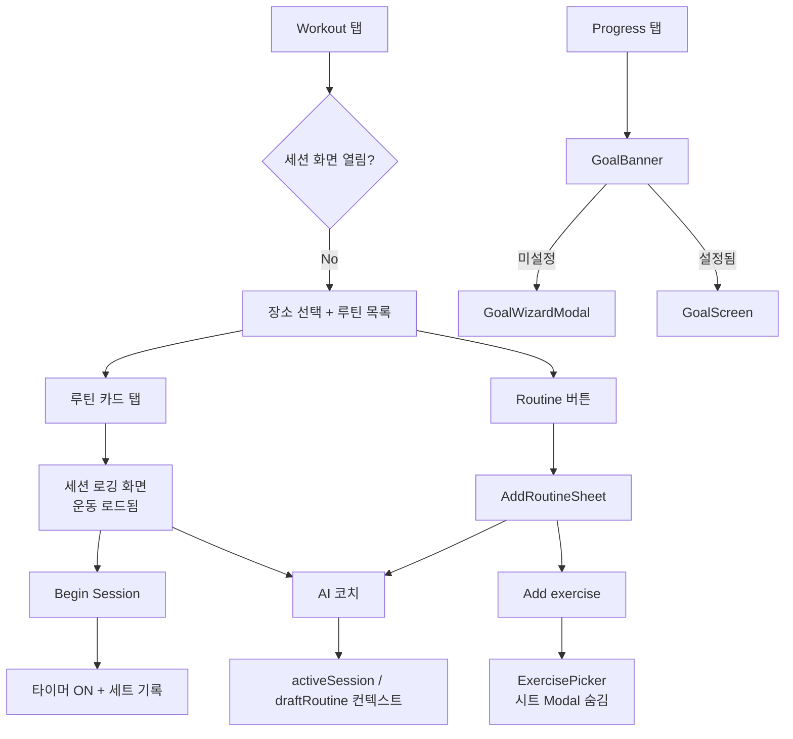

# Formé Fitness — 프로젝트 컨텍스트

> 이 문서는 Cursor/AI 및 개발자가 **의도·흐름·철학·구현 상태**를 빠르게 파악하기 위한 통합 컨텍스트입니다.  
> 최종 갱신: 2026-06-08 (대화 세션 기준)

---

## 1. 프로젝트 개요

**Formé Fitness**는 개인 운동 기록, 루틴 관리, 진행 추적, AI 코치, 목표(Goal) 시각화를 하나의 모바일 앱으로 제공하는 **Expo (SDK 54) + React Native** 앱입니다.

| 항목 | 내용 |
|------|------|
| 스택 | Expo 54, React 19, React Native 0.81, TypeScript, Zustand, Supabase |
| 라우팅 | expo-router (`app/(tabs)/…`) |
| 백엔드 | Supabase (Auth, profiles, 향후 goal/workout 동기화) |
| AI | Claude (코치 채팅, Goal Vision 분석), OpenAI (Goal 위저드·이미지 생성) |
| 플랫폼 | iOS / Android (dev client), macOS 개발 환경 |

**앱 철학 (제품 방향)**

- **데이터 기반 코칭**: AI는 일반적인 격려가 아니라 사용자의 실제 세션·PR·피로·루틴 데이터를 근거로 답한다.
- **최소 마찰 로깅**: 루틴 → 세션 → 세트 입력까지 탭 수를 줄인다. 불필요한 중간 화면은 제거한다.
- **목표의 시각화**: Goal Tier(1~6)와 체크인 사진으로 “변화”를 눈에 보이게 한다.
- **한·영 이중 언어**: UI·코치·운동명 모두 `language` 설정에 따라 일관되게 동작한다.
- **로컬 우선 + 점진적 클라우드**: 운동 기록·Goal은 AsyncStorage로 동작하며, Supabase 연동은 단계적으로 확장 중이다.

---

## 2. 대화·작업 흐름 (시간순 요약)

이번 세션에서 사용자와 AI가 함께 다룬 주제와 결정 사항입니다.

### 2.1 인증 · 프로필

| 요청 | 결과 |
|------|------|
| Google 로그인 후 이메일이 DB에 없음 | `profiles.email` 컬럼 추가, OAuth 후 `syncProfile`로 저장 |
| 기존 유저 확인 | service role key로 Supabase 조회 가능 (`.env` 필요) |

**의도**: Supabase `profiles`에 이메일을 남겨 관리·표시 가능하게 함. `auth.users`와 `profiles`를 동기화.

### 2.2 Goal (Progress 탭)

| 요청 | 결과 |
|------|------|
| Goal 위저드 + 배너 + 전용 스크린 | `GoalWizardModal`, `GoalScreen`, `GoalBanner` 구현 |
| Progress 라우트 크래시 | `goalOpenAi.ts` top-level `expo-image-manipulator` → lazy load |
| Goal 배너 위치 | 달력 **바로 위** |
| 사진 없이도 이미지 생성 | 남·여 2장, `quality: low` / 사진 있으면 `medium`, size `1024×1536` |
| Goal 스크린 UI | `FORME_GOAL_SCREEN.md` 기준 — 나의 변화 / 목표 비교, 체크인, Claude Vision |
| 배너 스타일 | 왼쪽 풀 이미지, 스포티 그레이 `#3A4048`, Barlow Black Italic, 「목표 변경」 링크 제거 |

**진입 로직**

```
Goal 미설정 → GoalWizardModal (6단계 + 사진 + AI)
Goal 설정됨 → GoalScreen (Progress 탭 내 풀스크린 모달)
```

**의도**: Progress 탭에서 “나의 변화”를 한눈에 보고, AI가 목표 체형 이미지·분석을 제공.

### 2.3 AI 코치 · 운동 컨텍스트

| 요청 | 결과 |
|------|------|
| 진행 중 세션을 코치가 알도록 | `summarizeActiveSession` → `CoachWorkoutPlan` |
| 루틴 안 리스트를 읽고 대화 | `coachWorkoutContextStore` + `buildCoachWorkoutPlan` |
| 루틴 상세 중간 화면 제거 | `RoutineDetailSheet` 삭제, 루틴 탭 → 바로 세션 로깅 화면 |

**코치 컨텍스트 우선순위**

```
1. active_session   — 오늘 세션 (준비/진행/일시정지, 세트 진행 포함)
2. draft_routine    — AddRoutineSheet 작성 중
3. viewing_routine  — (상세 시트 제거 후 직접 진입 경로는 없음, store는 유지)
```

**의도**: “지금 이 루틴/세션 기준으로 뭐 추가할까?”에 코치가 구체적 운동명으로 답할 수 있게 함.

### 2.4 Workout · 루틴 UX

| 요청 | 결과 |
|------|------|
| Routine → Add exercise 버튼 무반응 (iOS) | **Modal 중첩 문제** — 피커 열 때 루틴 시트 Modal 숨김 |
| 중간 RoutineDetailSheet 제거 | 루틴 카드 탭 → `handleStartRoutine` → **세션 로깅 화면** |

**Workout 화면 구조 (핵심)**

```
Workout 탭
├── sessionScreenOpen === false
│   └── 장소 탭 + RoutineSection (루틴 목록)
└── sessionScreenOpen === true  ← "세션 로깅 화면" (사용자가 원하는 화면)
    ├── SessionTimerBar (타이머 시작 후)
    ├── SessionExerciseList (운동별 세트 입력)
    ├── Add exercise
    └── Begin Session (타이머 시작 — runningStartedAt 설정)
```

**의도**

- 루틴 선택 = 곧바로 **세션 준비 + 운동 로드** (`startSession` + `addExercise`).
- 「세션 시작」= 타이머 ON (`beginSession`). 루틴 탭과 타이머 시작을 분리한 현재 UX.
- iOS에서는 **Modal 위 Modal 불가** → 한 번에 하나의 Modal만 `visible`.

### 2.5 스크립트 · 디버깅

| 항목 | 내용 |
|------|------|
| `generate_motivation_images.py` | OpenAI gpt-image-2, 30장 티어별 모티베이션 이미지 |
| 해결한 이슈 | `.venv` openai 설치, `response_format` 제거, size 16배수, b64/url 둘 다 처리 |

---

## 3. 화면별 역할 · 용도

### Workout (`app/(tabs)/workout.tsx`)

- **장소**(GYM/HOME/+) 선택 → 해당 장소 **루틴 목록**
- 루틴 탭 → 세션 생성 + 프리셋 운동 로드 → **세션 로깅 화면**
- 세트 입력, 휴식 타이머, 운동 추가/순서 변경
- X 버튼: 진행 중이면 화면만 닫고 세션 유지; 준비 중이면 종료 확인

### Progress (`app/(tabs)/progress.tsx`)

- **GoalBanner** (달력 위) → 위저드 또는 GoalScreen
- 달력, Streak / Workout Detail 패널
- Goal: 체크인 사진, AI 분석, 목표 비교

### Profile · Auth

- Google / Apple OAuth
- 코치 API 키, 언어, 컨디션(수면·피로) 설정
- `profiles.email` 표시

### AI 코치 (`CoachFloatingChat`)

- Claude 기반 플로팅 채팅
- `buildCoachContextData` + `buildCoachSystemPrompt`로 사용자 데이터 주입
- 일일 인사, 루틴 추천, 차트 JSON 응답 지원

---

## 4. 아키텍처 · 핵심 파일

### 상태 (Zustand stores)

| Store | 역할 |
|-------|------|
| `workoutStore` | 진행 세션, `sessionScreenOpen`, pause, 세트 CRUD |
| `routineStore` | 장소별 저장 루틴 |
| `historyStore` | 완료 세션 기록 |
| `coachStore` | 코치 메시지, Claude API |
| `coachWorkoutContextStore` | draft/viewing 루틴 스냅샷 |
| `goalStore` | Goal 설정, 체크인 (AsyncStorage) |
| `authStore` / `userStore` | 로그인, 프로필 |
| `settingsStore` | 언어, 코치명, 컨디션, 휴식 기본값 |

### AI · Goal lib

| 파일 | 역할 |
|------|------|
| `lib/coachStats.ts` | `CoachWorkoutPlan`, `buildCoachWorkoutPlan`, fatigue, PR, weekly |
| `lib/coachPrompt.ts` | 시스템 프롬프트, 한국어 규칙, 추천 우선순위 |
| `lib/claude.ts` | 코치 API 호출 |
| `lib/goalOpenAi.ts` | Goal 위저드 chat/image (모델 분리, b64+url) |
| `lib/goalProgress.ts` | D+N, 진행률 |
| `lib/goalScreenAnalysis.ts` | Goal 스크린 Claude Vision |

### Workout UI

| 파일 | 역할 |
|------|------|
| `RoutineSection.tsx` | 루틴 목록, Add Routine |
| `AddRoutineSheet.tsx` | 루틴 작성 (iOS Modal 교체 패턴) |
| `ExercisePicker.tsx` | 운동 카탈로그 검색·필터 |
| `SessionExerciseList.tsx` | 세션 내 운동·세트 UI |

### Goal UI

| 파일 | 역할 |
|------|------|
| `GoalWizardModal.tsx` | 6단계 위저드 + AI |
| `GoalScreen.tsx` | Goal 전용 풀스크린 |
| `GoalBanner.tsx` | Progress 배너 |
| `GoalChangePanel` / `GoalComparePanel` | 탭 콘텐츠 |

### 참고 스펙 문서

- `FORME_GOAL_SCREEN.md` — Goal 스크린 상세 스펙
- `FORME_GOAL_WIZARD.md` — (별도 파일, 위저드 6단계)
- `AGENTS.md` — Expo v54 문서 링크 필수

---

## 5. 데이터 모델 · 타입 (요약)

```typescript
// 코치가 읽는 운동 플랜
CoachWorkoutPlan {
  source: 'active_session' | 'viewing_routine' | 'draft_routine'
  status?: 'preparing' | 'running' | 'paused'  // active_session만
  routineName?, exercises[], muscleSummary[]
}

// 세션
WorkoutSession {
  id, startedAt, runningStartedAt?, endedAt?
  locationId, routineId?, exercises: WorkoutExercise[]
}

// 루틴
WorkoutRoutine {
  id, locationId, name, exercises: RoutineExerciseEntry[]
}
```

**Goal Tier**: 1 (Lean & Clean) ~ 6 (Elite) — 코치 추천·이미지 프롬프트에 사용.

---

## 6. UX · 기술 결정 (철학이 반영된 것)

### Modal (iOS)

- React Native `Modal`은 z-index가 아니라 **네이티브 present 레이어**.
- Modal 위 Modal → 두 번째가 보이지 않음.
- **해결 패턴**: `sheetModalVisible = visible && !pickerVisible`, `pickerModalVisible = visible && pickerVisible`.

### 세션 화면 vs 루틴 목록

- `sessionScreenOpen`으로 **데이터(세션)는 유지**하면서 UI만 루틴 목록으로 돌아갈 수 있음.
- 진행 중 배너(`activeSessionHint`)로 세션 화면 재진입.

### 코치 프롬프트

- `activeSession` 필드명은 유지하나 실제로는 `CoachWorkoutPlan` (source 포함).
- 한국어 앱일 때 **모든 응답·JSON 문자열 한국어** 강제.
- 이모지 금지, 최대 7문장, 실제 데이터 인용.

### Goal 이미지

- Chat API ≠ Image API — 모델 분리 (`EXPO_PUBLIC_OPENAI_CHAT_MODEL` / `IMAGE_MODEL`).
- gpt-image-2: `response_format` 미지원, size는 **16의 배수** (예: 1024×1536).

### 코드 스타일 (개발 원칙)

- **최소 diff**: 요청 범위 밖 리팩터 금지.
- **기존 컨벤션 따르기**: Zustand, `t()` i18n, theme constants.
- **주석**: 비즈니스 로직·플랫폼 이슈만 (한글 OK).
- **Expo 54**: 코드 작성 전 [공식 v54 문서](https://docs.expo.dev/versions/v54.0.0/) 확인.

---

## 7. 환경 변수

```env
# Supabase
EXPO_PUBLIC_SUPABASE_URL=
EXPO_PUBLIC_SUPABASE_ANON_KEY=
SUPABASE_SERVICE_ROLE_KEY=          # 서버/스크립트 조회용

# Google OAuth
EXPO_PUBLIC_GOOGLE_WEB_CLIENT_ID=
EXPO_PUBLIC_GOOGLE_IOS_CLIENT_ID=

# AI
EXPO_PUBLIC_ANTHROPIC_API_KEY=      # 코치, Goal Vision
EXPO_PUBLIC_OPENAI_API_KEY=         # Goal 위저드, 이미지
EXPO_PUBLIC_OPENAI_CHAT_MODEL=gpt-4o-mini
EXPO_PUBLIC_OPENAI_IMAGE_MODEL=gpt-image-2
```

**iOS 권한** (`app.config.ts`): `NSPhotoLibraryUsageDescription`, `NSCameraUsageDescription` — Goal 사진, dev client **재빌드** 필요.

---

## 8. 알려진 이슈 · 미완료

| 항목 | 상태 |
|------|------|
| Goal / check-in Supabase 동기화 | 로컬 AsyncStorage만 |
| Home 카드 Goal 진입 | Progress와 동일 로직 미연동 가능 |
| TS 린트 (기존) | `CoachFloatingChat`, `RoutineWarningCard`, `ExerciseDetailSheet`, `routineStore.is_active` |
| 루틴 탭 시 타이머 자동 시작 | 미구현 — 사용자 요청 시 `beginSession` 연동 가능 |
| `viewing_routine` 코치 source | 상세 시트 제거 후 UI 경로 없음, store·로직은 잔존 |

---

## 9. 사용자 여정 (현재 기준)



---

## 10. AI 에이전트에게 주는 지침

1. **Expo 54** 문서 기준으로만 API 사용 (`AGENTS.md`).
2. Workout에서 **중간 확인 시트 추가하지 말 것** — 사용자는 루틴 탭 → 바로 세션 로깅을 원함.
3. iOS **Modal 중첩 금지** — picker/sheet 동시 visible 패턴 사용.
4. 코치 변경 시 `coachStats.ts` + `coachPrompt.ts` + `coachStore` 함께 확인.
5. Goal 변경 시 lazy import 유지 (`imageManipulator` 등 네이티브 모듈).
6. 커밋/PR은 사용자가 명시적으로 요청할 때만.
7. 응답·주석 한글 선호 (macOS 개발 환경).

---

## 11. 관련 대화 기록

Cursor agent transcript: `b4668bc7-988c-4b50-bbb7-17c1e984330f`  
(Google 이메일, Goal, 코치 컨텍스트, iOS Modal, RoutineDetailSheet 제거 등 전체 흐름)

---

*이 파일은 기능 추가·UX 변경 시 함께 업데이트하는 것을 권장합니다.*
